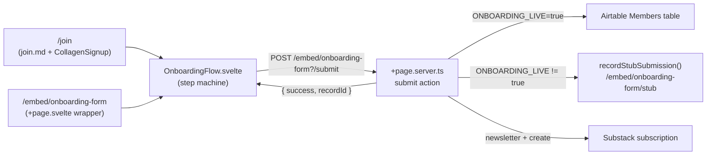
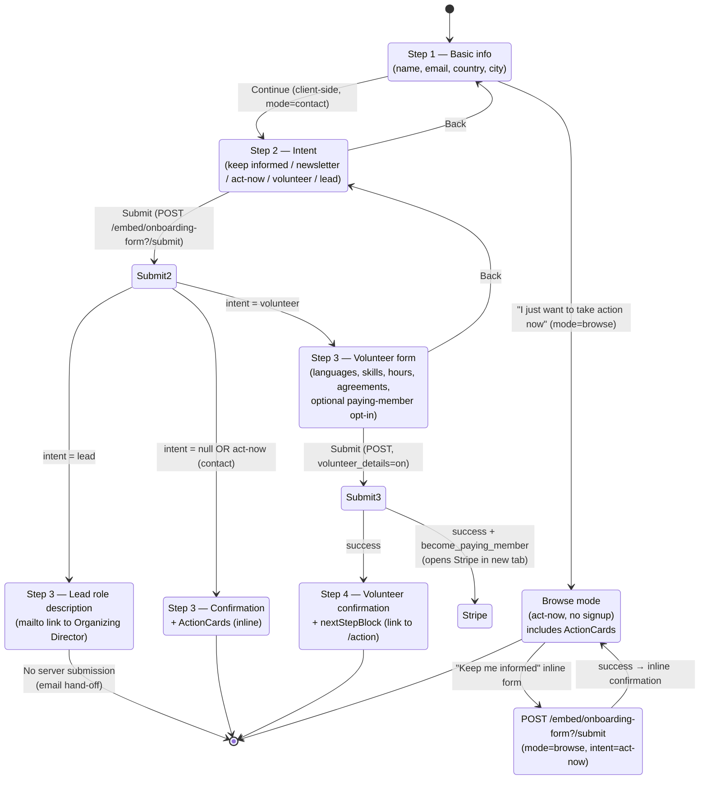

# Join Form Flow

This document describes the flow of the PauseAI join / onboarding form, from the
landing page through to the Airtable write (or stub capture) and optional
Substack subscription.

## Entry points and how they interact

The same `OnboardingFlow.svelte` component is mounted from two routes that wrap
it differently. Both routes share a single submit endpoint
(`/embed/onboarding-form?/submit`), so the server-side validation, Airtable
write, and stub capture logic live in exactly one place.

### Route 1 — `/join` (standalone page)

| File                                                  | Role                                                                                                                                                            |
| ----------------------------------------------------- | --------------------------------------------------------------------------------------------------------------------------------------------------------------- |
| `src/posts/join.md`                                   | Markdown post rendered by the generic `src/routes/[slug]/+page.svelte` route. Holds the page's `<script>` and mounts the two components.                        |
| `src/lib/components/CollagenSignup.svelte`            | Detects a Collagen campaign UID from the URL (`?collagen_uid_sayno=…`) and reads `?subscribe-email=`. Binds `userHasUid` and `subscribeEmail` back to the post. |
| `src/lib/components/onboarding/OnboardingFlow.svelte` | The multi-step form itself. Mounted with `initialEmail={subscribeEmail}` so a returning Collagen visitor's email is pre-filled.                                 |

Flow on `/join`:

1. `CollagenSignup` runs `detectAndStoreCollagenUid('sayno', page.url.searchParams)`
   on mount. If a UID is present it sets `userHasUid = true` and reads
   `subscribeEmail` from `?subscribe-email=`. When both are set it shows a
   "Welcome collage member!" banner with a `NewsletterSignup` form.
2. `OnboardingFlow` is rendered immediately below, regardless of Collagen state,
   so every `/join` visitor sees the full onboarding form. The Collagen banner
   is purely additive — it does not gate or replace the form.
3. When `userHasUid && subscribeEmail` are both truthy, `join.md` appends a
   short "Consider becoming an active PauseAI member using the form above!"
   prompt beneath the form.
4. `OnboardingFlow` does **not** receive `initialCountry` / `initialCity` /
   `initialLanguages` here — those are left at their defaults (empty / empty /
   `['English']`). Prefilling by geography is an embed-only feature (see below).

> Note: `join.md` passes `initialEmail={subscribeEmail}`, but the current
> `OnboardingFlow` props are `initialCountry`, `initialCity`, and
> `initialLanguages` only — there is no `initialEmail` prop yet. The email field
> in step 1 is therefore not prefilled from Collagen today. If you wire that
> prop up, update this section and the component's `Props` block together.

### Route 2 — `/embed/onboarding-form` (iframeable embed)

| File                                                    | Role                                                                                                                                          |
| ------------------------------------------------------- | --------------------------------------------------------------------------------------------------------------------------------------------- |
| `src/routes/embed/onboarding-form/+page.svelte`         | Thin wrapper around `OnboardingFlow`. Reads query params, sets the locale, applies the background color, and reports height to the host page. |
| `src/routes/embed/onboarding-form/+page.server.ts`      | Houses the `submit` action shared by **both** routes (see "Submit endpoint" below).                                                           |
| `src/routes/embed/onboarding-form/stub/+page.svelte`    | Stub inspection page rendered when `ONBOARDING_LIVE` is not `true`.                                                                           |
| `src/routes/embed/onboarding-form/stub/+page.server.ts` | `load` function returning in-memory stub submissions.                                                                                         |

The embed wrapper does four things the `/join` route does not:

1. **Query-param prefill** — reads `?country=`, `?city=`, `?languages=` and
   passes them to `OnboardingFlow` as `initialCountry` / `initialCity` /
   `initialLanguages`. Unmatched language values are silently dropped against
   the stored values in `options.ts`. See `docs/ONBOARDING_EMBED.md` for the
   full param table and the rationale for which fields are not prefillable.
2. **Locale** — reads `?locale=` and calls `setOnboardingLocale()` from
   `src/lib/components/onboarding/i18n.svelte.ts` so partner sites can render
   the form in a supported language.
3. **Background color** — reads `?bg=` (hex with or without `#`, or a CSS color
   name) and applies it as `style:background-color` on the wrapper so the embed
   blends into the host page.
4. **Height reporting** — when `window.self !== window.top` (i.e. iframed), a
   `ResizeObserver` posts `{ height: number }` to the parent via `postMessage`
   on every layout change so the host can resize the iframe. The wrapper also
   drops its `min-height: 100dvh` in embedded mode so the reported height can
   shrink as well as grow.

### The shared submit endpoint

Both routes' forms `POST` to the same action:

```
action="/embed/onboarding-form?/submit"
```

This is intentional: the `submit` action in
`src/routes/embed/onboarding-form/+page.server.ts` is the single source of
truth for validation, Airtable writes, Substack subscription, and stub capture.
The `/join` route has **no** `+page.server.ts` with a `submit` action of its
own — it relies entirely on the embed route's action. SvelteKit's form actions
are addressed by URL, so a form rendered on `/join` can post to
`/embed/onboarding-form?/submit` without any special wiring.

The action returns `{ success: true, recordId }` on a create, or
`{ success: true, recordId: existingRecordId, submission }` in stub mode.
`OnboardingFlow` stores the returned `recordId` in component state and sends it
back as a hidden `record_id` input on the step-3 volunteer form, so the
volunteer details update the existing Airtable record instead of creating a
duplicate.

### Component overview

`OnboardingFlow.svelte` is a self-contained state machine. It owns:

- `step` (`1 → 4`), `mode` (`'contact' | 'browse'`), `intent`
  (`'act-now' | 'volunteer' | 'lead' | null`), and the `basics` / `volunteer` /
  `agreements` / `gdprConsent` / `becomePayingMember` state.
- All form markup for steps 1–4, including the browse-mode inline signup and
  the lead-path `mailto:` hand-off (no submission).
- A `submitWith(onSuccess)` helper that wraps SvelteKit's `enhance` to manage
  the `submitting` flag, capture the returned `recordId`, and surface errors
  via `svelte-french-toast`.

It delegates rendering to a few child components and snippets:

| Child                                                                                                                                                         | Used for                                                                 |
| ------------------------------------------------------------------------------------------------------------------------------------------------------------- | ------------------------------------------------------------------------ |
| `Stepper.svelte`                                                                                                                                              | The numbered step indicator above the form (contact mode only).          |
| `ActionCards.svelte`                                                                                                                                          | The "ways to help" card grid shown on the act-now confirmation / browse. |
| `Combobox.svelte`                                                                                                                                             | The searchable country dropdown (used in step 1 and browse signup).      |
| `LinkWithoutIcon.svelte`, `Socials.svelte`                                                                                                                    | Footer links on confirmation screens.                                    |
| Snippets: `honeypotField`, `countrySelect`, `hiddenBasics`, `selectCards`, `checkboxConfirmations`, `gdprConsentField`, `nextStepBlock`, `confirmationFooter` | Reusable markup fragments shared across steps.                           |

On mount, the component fetches `GET /api/onboarding-mode` and logs whether the
form is live or stubbed to the browser console. This is needed because the
pages embedding the form can be prerendered (e.g. `/join`), so the runtime env
isn't available at render time.

### Supporting API routes

| Route                      | File                                        | Purpose                                                                                                              |
| -------------------------- | ------------------------------------------- | -------------------------------------------------------------------------------------------------------------------- |
| `GET /api/onboarding-mode` | `src/routes/api/onboarding-mode/+server.ts` | Returns `{ live: boolean }` so the prerendered form can discover the runtime mode.                                   |
| `GET /api/national-groups` | `src/routes/api/national-groups/+server.ts` | Returns the list of national groups. Used by the component (lead-role copy) and the submit action (chapter routing). |

### How a submission travels



Both entry points converge on the same component and the same action, so
validation rules, field allowlists, and the live/stub switch only need to be
maintained in one place.

## Step machine

`OnboardingFlow` is a small state machine with a `step` counter
(`1 → 2 → 3 → 4`) and two derived values: `mode` (`'contact' | 'browse'`) and
`intent` (`'act-now' | 'volunteer' | 'lead' | null`).



## Data written to Airtable

Target: base `appWPTGqZmUcs3NWu`, table `tblL1icZBhTV1gQ9o` ("Members").

**Step 2 / browse signup (create):** `Full name`, `Email`, `Country`, `City`,
`Intent`, `Signup source`, `Email subscription` (keep_informed),
`Data privacy policy agreed`, `GDPR chapter share permission`.

**Step 3 volunteer (update, only when `volunteer_details=on`):** adds
`Discord Username`, `Phone`, `Languages`, `Other languages`,
`Discovery method of PAI`, `Discovery method of PAI (Other)`, `Motivation`,
`Motivation (Other)`, `Skills & Interests`, `Skill & Interests (Other)`,
`Projected weekly hours`, `Volunteer Agreement`, `Code of Conduct agreed`, and
`Zip code` (US only).

## Validation rules

Enforced in the `submit` action before any write:

- Required: `full_name`, `email`, `country`, `city`.
- `email` must match `^\S+@\S+\.\S+$`.
- `country` must be in `COUNTRIES`.
- `intent` must be one of `INTENTS` (`Act now` | `Volunteer` | `Lead` | `Keep informed`).
- GDPR consent (`agree_gdpr`) required **only on the create path** — step-3
  volunteer updates are exempt because consent was captured at step 2.
- Volunteer path additionally requires: ≥1 language, a valid `hours` value, and
  both `agree_volunteer` and `agree_conduct` checkboxes.
- Honeypot: a non-empty `nickname` field silently returns success (bot caught,
  no write performed).

## Live vs. stub mode

`isOnboardingLive()` in `src/lib/server/onboarding.ts` reads the
`ONBOARDING_LIVE` env var. When false (default), submissions are captured
in-memory by `recordStubSubmission()` and rendered at
`/embed/onboarding-form/stub` for inspection — no Airtable write and no Substack
subscription occur. The component surfaces the current mode in the browser
console via `GET /api/onboarding-mode`.

## Lead path (no submission)

When `intent = 'lead'`, step 3 renders a role description and a `mailto:` link
to the Organizing Director (Irina@pauseai.info). The country is checked against
`/api/national-groups` to decide between "National Group Lead" (no existing
chapter) and "Regional Group Lead" (chapter exists). No POST is made; the
hand-off happens off-platform via email.

## Paying member opt-in (volunteer step)

The volunteer form (step 3) includes an optional "I want to become a paying
member" checkbox (`become_paying_member`). It is **not** required, so it does
not gate the submit button.

When checked, the volunteer form opens the Stripe payment link in a new tab
with two query params, mirroring the legacy Tally form's `/submitted` contract:

- `prefilled_email` — the volunteer's email.
- `client_reference_id` — the Airtable record id, replacing Tally's submission id.

The popup is opened synchronously during the submit gesture (so iOS Safari
and Chrome on iOS allow it), then navigated to the final Stripe URL once the
record has been saved.

The user stays in the onboarding flow: the form advances to the step-4
volunteer confirmation regardless of whether the checkbox was checked. The
`/submitted` route is **not** used by this path — it remains for the legacy
Tally form only.

### Stripe success redirect (`/close`)

After completing payment, Stripe redirects the popup to [`/close`](../src/routes/close/+page.svelte),
which closes the tab automatically. If the browser blocks the close (e.g. the
user navigated manually), a brief "Thanks for your donation!" message is
shown as a fallback. The Stripe success URL must be configured to
`https://pauseai.info/close`.

## Related documents

- [`docs/ONBOARDING_EMBED.md`](./ONBOARDING_EMBED.md) — embed-specific details:
  the full query-param table (`country`, `city`, `languages`, `bg`), the
  `postMessage` height-resize contract for host pages, and the rationale for
  which fields are intentionally not prefillable via URL.
