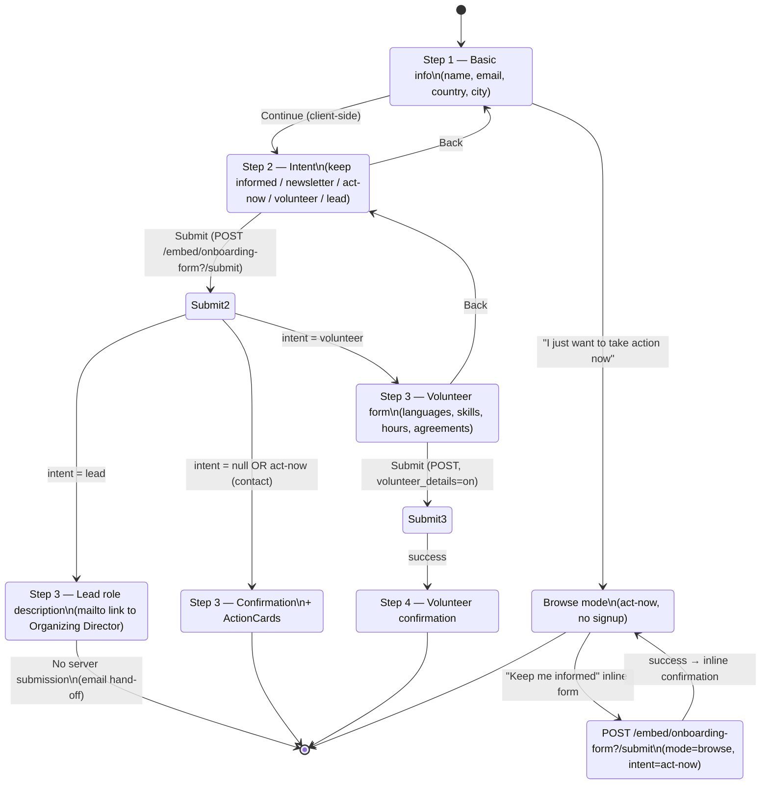
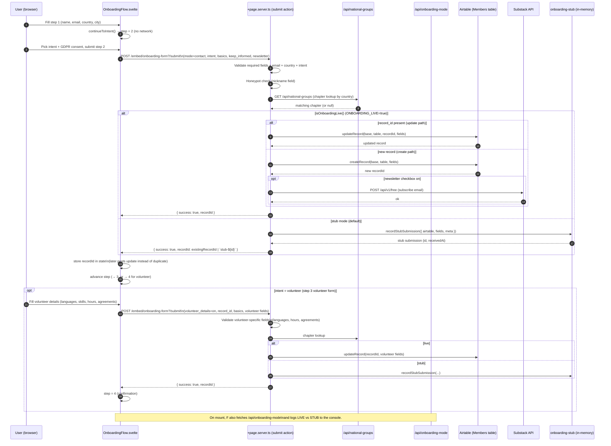

# Join Form Flow

This document describes the flow of the PauseAI join / onboarding form, from the
landing page through to the Airtable write (or stub capture) and optional
Substack subscription.

## Entry points

The same `OnboardingFlow.svelte` component is mounted from two routes:

| Route                    | File                                                     | Notes                                                                                                                                         |
| ------------------------ | -------------------------------------------------------- | --------------------------------------------------------------------------------------------------------------------------------------------- |
| `/join`                  | `src/posts/join.md` (rendered via `[slug]/+page.svelte`) | Standalone page. Optionally preceded by `CollagenSignup`, which pre-fills `subscribeEmail` when a Collagen UID is detected in the URL.        |
| `/embed/onboarding-form` | `src/routes/embed/onboarding-form/+page.svelte`          | Embeddable version (iframed by partner sites). Reads `?country=` and `?bg=` query params; reports its height to the parent via `postMessage`. |

Both render `<OnboardingFlow />` from
`src/lib/components/onboarding/OnboardingFlow.svelte`.

## Step machine

`OnboardingFlow` is a small state machine with a `step` counter
(`1 → 2 → 3 → 4`) and two derived values: `mode` (`'contact' | 'browse'`) and
`intent` (`'act-now' | 'volunteer' | 'lead' | null`).

## Server action

All form posts target the `submit` action in
`src/routes/embed/onboarding-form/+page.server.ts`. The action is shared by the
step-2 (basic + intent), browse-mode inline signup, and step-3 volunteer detail
posts. It distinguishes them by the `mode`, `volunteer_details`, and
`record_id` hidden fields.

## Data written to Airtable

Target: base `appWPTGqZmUcs3NWu`, table `tblL1icZBhTV1gQ9o` ("Members").

**Step 2 / browse signup (create):** `Full name`, `Email`, `Country`, `City`,
`Intent`, `Signup source`, `Email subscription` (keep_informed),
`Data privacy policy agreed`, `GDPR chapter share permission`.

**Step 3 volunteer (update, only when `volunteer_details=on`):** adds
`Discord Username`, `Phone`, `Languages`, `Other languages`,
`Discovery method of PAI`, `Discovery method of PAI (Other)`, `Motivation`,
`Motivation (Other)`, `Skills & Interests`, `Skill & Interests (Other)`,
`Projected weekly hours`, `Volunteer Agreement`, `Code of Conduct agreed`, and
`Zip code` (US only).

## Validation rules

Enforced in the `submit` action before any write:

- Required: `full_name`, `email`, `country`, `city`.
- `email` must match `^\S+@\S+\.\S+$`.
- `country` must be in `COUNTRIES`.
- `intent` must be one of `INTENTS` (`Act now` | `Volunteer` | `Lead` | `Keep informed`).
- GDPR consent (`agree_gdpr`) required **only on the create path** — step-3
  volunteer updates are exempt because consent was captured at step 2.
- Volunteer path additionally requires: ≥1 language, a valid `hours` value, and
  both `agree_volunteer` and `agree_conduct` checkboxes.
- Honeypot: a non-empty `nickname` field silently returns success (bot caught,
  no write performed).

## Live vs. stub mode

`isOnboardingLive()` in `src/lib/server/onboarding.ts` reads the
`ONBOARDING_LIVE` env var. When false (default), submissions are captured
in-memory by `recordStubSubmission()` and rendered at
`/embed/onboarding-form/stub` for inspection — no Airtable write and no Substack
subscription occur. The component surfaces the current mode in the browser
console via `GET /api/onboarding-mode`.

## Lead path (no submission)

When `intent = 'lead'`, step 3 renders a role description and a `mailto:` link
to the Organizing Director (Irina@pauseai.info). The country is checked against
`/api/national-groups` to decide between "National Group Lead" (no existing
chapter) and "Regional Group Lead" (chapter exists). No POST is made; the
hand-off happens off-platform via email.
