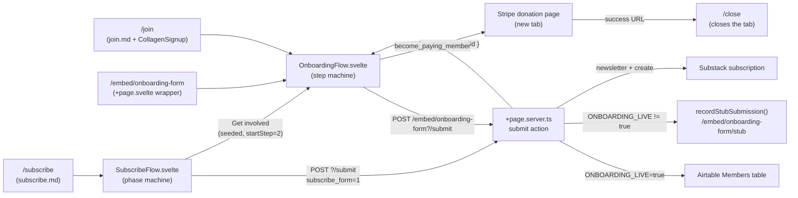
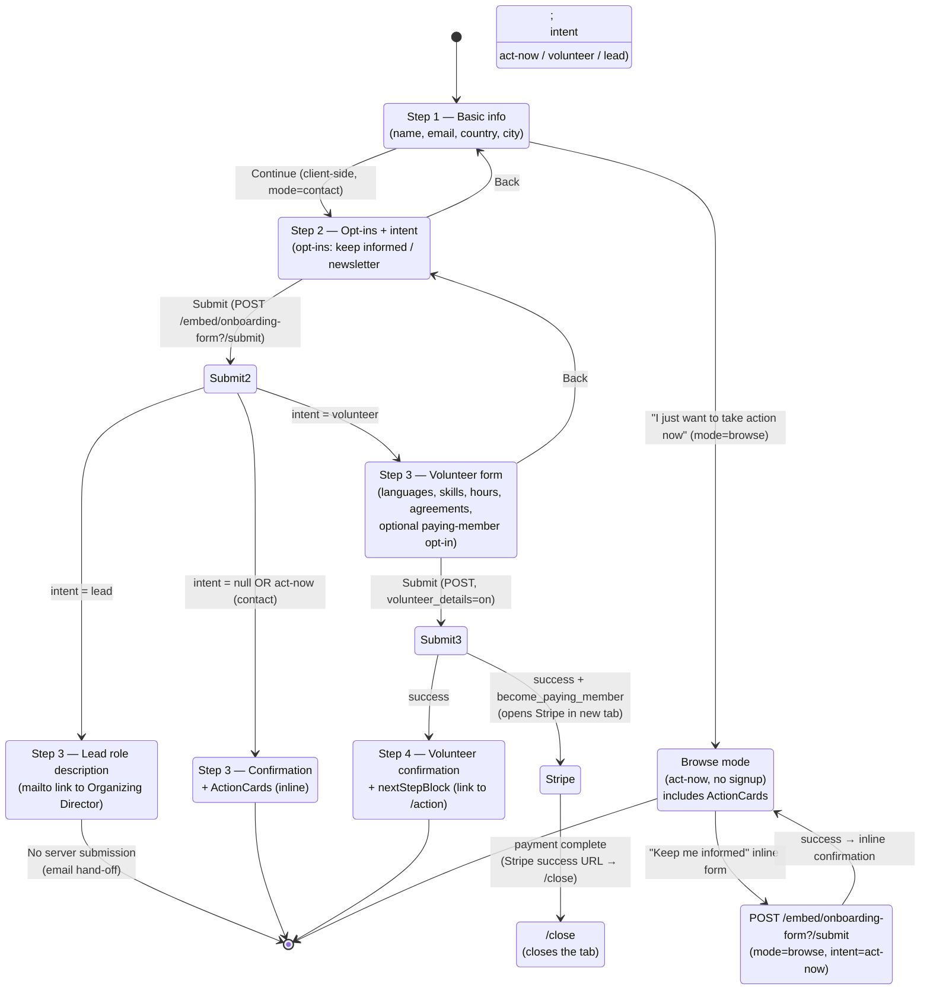

# Join Form Flow

This document describes the flow of the PauseAI join / onboarding form, from the
landing page through to the Airtable write (or stub capture) and optional
Substack subscription. It also covers `/subscribe`, the newsletter-only signup,
which is a different form with a different consent model but posts to the same
endpoint.

## Entry points and how they interact

There are three entry points. Two mount the same `OnboardingFlow.svelte`
component with different wrappers; the third mounts `SubscribeFlow.svelte`, a
separate single-page form that can hand off to `OnboardingFlow` mid-flow. All
three share a single submit endpoint (`/embed/onboarding-form?/submit`), so the
server-side validation, Airtable write, and stub capture logic live in exactly
one place.

### Route 1 — `/join` (standalone page)

| File                                                  | Role                                                                                                                                                            |
| ----------------------------------------------------- | --------------------------------------------------------------------------------------------------------------------------------------------------------------- |
| `src/posts/join.md`                                   | Markdown post rendered by the generic `src/routes/[slug]/+page.svelte` route. Holds the page's `<script>` and mounts the two components.                        |
| `src/lib/components/CollagenSignup.svelte`            | Detects a Collagen campaign UID from the URL (`?collagen_uid_sayno=…`) and reads `?subscribe-email=`. Binds `userHasUid` and `subscribeEmail` back to the post. |
| `src/lib/components/onboarding/OnboardingFlow.svelte` | The multi-step form itself. Mounted with `initialEmail={subscribeEmail}` so a returning Collagen visitor's email is pre-filled.                                 |

Flow on `/join`:

1. `CollagenSignup` runs `detectAndStoreCollagenUid('sayno', page.url.searchParams)`
   on mount. If a UID is present it sets `userHasUid = true` and reads
   `subscribeEmail` from `?subscribe-email=`. When both are set it shows a
   "Welcome collage member!" banner with a `NewsletterSignup` form.
2. `OnboardingFlow` is rendered immediately below, regardless of Collagen state,
   so every `/join` visitor sees the full onboarding form. The Collagen banner
   is purely additive — it does not gate or replace the form.
3. When `userHasUid && subscribeEmail` are both truthy, `join.md` appends a
   short "Consider becoming an active PauseAI member using the form above!"
   prompt beneath the form.
4. `OnboardingFlow` does **not** receive `initialCountry` / `initialCity` /
   `initialLanguages` here — those are left at their defaults (empty / empty /
   `['English']`). Prefilling by geography is an embed-only feature (see below).

### Route 2 — `/embed/onboarding-form` (iframeable embed)

| File                                                    | Role                                                                                                                                          |
| ------------------------------------------------------- | --------------------------------------------------------------------------------------------------------------------------------------------- |
| `src/routes/embed/onboarding-form/+page.svelte`         | Thin wrapper around `OnboardingFlow`. Reads query params, sets the locale, applies the background color, and reports height to the host page. |
| `src/routes/embed/onboarding-form/+page.server.ts`      | Houses the `submit` action shared by **all three** entry points (see "Submit endpoint" below).                                                |
| `src/routes/embed/onboarding-form/stub/+page.svelte`    | Stub inspection page rendered when `ONBOARDING_LIVE` is not `true`.                                                                           |
| `src/routes/embed/onboarding-form/stub/+page.server.ts` | `load` function returning in-memory stub submissions.                                                                                         |

The embed wrapper does four things the `/join` route does not:

1. **Query-param prefill** — reads `?country=`, `?city=`, `?languages=` and
   passes them to `OnboardingFlow` as `initialCountry` / `initialCity` /
   `initialLanguages`. Unmatched language values are silently dropped against
   the stored values in `options.ts`. See `docs/ONBOARDING_EMBED.md` for the
   full param table and the rationale for which fields are not prefillable.
2. **Locale** — reads `?locale=` and calls `setOnboardingLocale()` from
   `src/lib/components/onboarding/i18n.svelte.ts` so partner sites can render
   the form in a supported language.
3. **Background color** — reads `?bg=` (hex with or without `#`, or a CSS color
   name) and applies it as `style:background-color` on the wrapper so the embed
   blends into the host page.
4. **Height reporting** — when `window.self !== window.top` (i.e. iframed), a
   `ResizeObserver` posts `{ height: number }` to the parent via `postMessage`
   on every layout change so the host can resize the iframe. The wrapper also
   drops its `min-height: 100dvh` in embedded mode so the reported height can
   shrink as well as grow.

### Route 3 — `/subscribe` (newsletter-only signup)

| File                                                 | Role                                                                                                                                 |
| ---------------------------------------------------- | ------------------------------------------------------------------------------------------------------------------------------------ |
| `src/posts/subscribe.md`                             | Markdown post, `showTitle: false` so `SubscribeFlow` can own the heading. Reads `?subscribe-email=` and passes it as `initialEmail`. |
| `src/lib/components/onboarding/SubscribeFlow.svelte` | The single-page signup form, its thanks screen, and the hand-off into `OnboardingFlow`.                                              |

This route exists so someone who only wants the newsletter can finish in one
screen instead of walking the multi-step join flow. It asks for the same four
basics (name, email, country, city) plus two opt-ins. Four of its hidden inputs
carry meaning: `subscribe_form=1` is the discriminator, `agree_gdpr=on` records
that signing up here is itself the consent, `keep_informed=on` is posted
unconditionally so every completed submission subscribes, and
`intent=None` is fixed, because the form never asks about intent: the row records
no intent until the person picks one in the "Get involved" continuation.

`SubscribeFlow` is a three-phase machine rather than a step counter:

- `form` — the signup itself.
- `thanks` — confirmation, with a "Get involved" button.
- `more` — renders `OnboardingFlow` seeded from the row that was just created,
  so choosing to do more **updates** that record rather than creating a second
  one. The seed is `startStep={2}`, `initialRecordId={recordId}`,
  `initialKeepInformed={true}` and `initialChapterShare={fields.wantsChapter}`,
  plus the four basics.

Navigating to `/subscribe` while already on it resets the machine to `form` and
clears every field, so a second visitor on a shared device does not see the
previous person's details.

**Entry points into this route.** `handoffHref` is the switch: given that prop,
`NewsletterSignup` stops posting to Substack and instead navigates to
`/subscribe?subscribe-email=…`, in both its hydrated `goto()` and its native
form `action`, so the hand-off survives without JavaScript. The homepage box
sets it; the Collagen banner on `/join` does not, which is why that one still
posts to Substack. `?subscribe-email=` therefore has two independent consumers.

### The shared submit endpoint

All three entry points' onboarding forms `POST` to the same action:

```
action="/embed/onboarding-form?/submit"
```

This is intentional: the `submit` action in
`src/routes/embed/onboarding-form/+page.server.ts` is the single source of
truth for validation, Airtable writes, and stub capture. The one exception
worth knowing: a `NewsletterSignup` rendered without `handoffHref`, as the
Collagen banner on `/join` does, posts straight to Substack and never reaches
this action.

The `/join` route has **no** `+page.server.ts` with a `submit` action of its
own. SvelteKit's form actions are addressed by URL, so a form rendered on
`/join` can post to `/embed/onboarding-form?/submit` without any special
wiring.

The action returns `{ success: true, recordId }` in live mode and
`{ success: true, recordId, submission }` in stub mode. Both components store
that `recordId` and repost it as a hidden `record_id` input, which is what
makes a later submission an update instead of a duplicate.

### Component overview

`OnboardingFlow.svelte` is a self-contained state machine. It owns:

- `step` (`1 → 4`), `mode` (`'contact' | 'browse'`), `intent`
  (`'act-now' | 'volunteer' | 'lead' | null`), and the `basics` / `volunteer` /
  `agreements` / `gdprConsent` / `becomePayingMember` state.
- **Anti-bot protection state:** `turnstileToken`, `turnstileNonce` (manages
  widget remounts after each submission), and the derived `canSubmit` flag
  (gates submit buttons until Turnstile verification is complete).
- All form markup for steps 1–4, including the browse-mode inline signup and
  the lead-path `mailto:` hand-off (no submission).
- A `submitWith(onSuccess)` helper that wraps SvelteKit's `enhance` to manage
  the `submitting` flag, reset the Turnstile widget after submission, capture
  the returned `recordId`, and surface errors via `svelte-french-toast`.

It delegates rendering to a few child components and snippets:

| Child                                      | Used for                                                                   |
| ------------------------------------------ | -------------------------------------------------------------------------- |
| `Stepper.svelte`                           | The numbered step indicator above the form (contact mode only).            |
| `ActionCards.svelte`                       | The "ways to help" card grid shown on the act-now confirmation / browse.   |
| `Combobox.svelte`                          | The searchable country dropdown (used in step 1 and browse signup).        |
| `Turnstile.svelte`                         | The Cloudflare Turnstile anti-bot widget rendered before every submission. |
| `LinkWithoutIcon.svelte`, `Socials.svelte` | Footer links on confirmation screens.                                      |

`SubscribeFlow.svelte` is one screen of fields with the same honeypot and
Turnstile protection, plus the phase machine described under Route 3.

On mount, both components fetch `GET /api/onboarding-mode`. `OnboardingFlow`
logs the answer to the browser console; both use it to decide whether the
Turnstile widget renders and whether a token is required to submit. This is needed because the
pages embedding the form can be prerendered (e.g. `/join`), so the runtime env
isn't available at render time.

### Supporting API routes

| Route                      | File                                        | Purpose                                                                                                              |
| -------------------------- | ------------------------------------------- | -------------------------------------------------------------------------------------------------------------------- |
| `GET /api/onboarding-mode` | `src/routes/api/onboarding-mode/+server.ts` | Returns `{ live: boolean }` so the prerendered form can discover the runtime mode.                                   |
| `GET /api/national-groups` | `src/routes/api/national-groups/+server.ts` | Returns the list of national groups. Used by the component (lead-role copy) and the submit action (chapter routing). |

### How a submission travels


```mermaid
flowchart LR
    Join["/join<br/>(join.md + CollagenSignup)"] --> Flow
    Embed["/embed/onboarding-form<br/>(+page.svelte wrapper)"] --> Flow
    Subscribe["/subscribe<br/>(subscribe.md)"] --> SubFlow
    SubFlow["SubscribeFlow.svelte<br/>(phase machine)"] -- "POST ?/submit<br/>subscribe_form=1" --> Action
    SubFlow -- "Get involved<br/>(seeded, startStep=2)" --> Flow
    Flow["OnboardingFlow.svelte<br/>(step machine)"] -- "POST /embed/onboarding-form?/submit" --> Action["+page.server.ts<br/>submit action"]
    Action -- "ONBOARDING_LIVE=true" --> Airtable["Airtable Members table"]
    Action -- "ONBOARDING_LIVE != true" --> Stub["recordStubSubmission()<br/>/embed/onboarding-form/stub"]
    Action -- "newsletter + create" --> Substack["Substack subscription"]
    Action -- "{ success, recordId }" --> Flow
    Flow -- "become_paying_member" --> Stripe["Stripe donation page<br/>(new tab)"]
    Stripe -- "success URL" --> Close["/close<br/>(closes the tab)"]
```

Every entry point converges on the same action, so validation rules, field
allowlists, and the live/stub switch only need to be maintained in one place.

## Step machine

`OnboardingFlow` is a small state machine with a `step` counter
(`1 → 2 → 3 → 4`) and two derived values: `mode` (`'contact' | 'browse'`) and
`intent` (`'act-now' | 'volunteer' | 'lead' | null`).


```mermaid
stateDiagram-v2
    [*] --> Step1
    Step1: Step 1 — Basic info<br/>(name, email, country, city)
    Step1 --> Step2: Continue (client-side, mode=contact)
    Step1 --> Browse: "I just want to take action now" (mode=browse)
    Browse: Browse mode<br/>(act-now, no signup)<br/>includes ActionCards

    Step2: Step 2 — Opt-ins + intent<br/>(opt-ins: keep informed / newsletter;<br/>intent: act-now / volunteer / lead)
    Step2 --> Step1: Back
    Step2 --> Submit2: Submit (POST /embed/onboarding-form?/submit)
    Submit2 --> Step3Confirm: intent = null OR act-now (contact)
    Submit2 --> Step3Volunteer: intent = volunteer
    Submit2 --> Step3Lead: intent = lead

    Browse --> BrowseSignup: "Keep me informed" inline form
    BrowseSignup: POST /embed/onboarding-form?/submit<br/>(mode=browse, intent=act-now)
    BrowseSignup --> Browse: success → inline confirmation

    Step3Volunteer: Step 3 — Volunteer form<br/>(languages, skills, hours, agreements,<br/>optional paying-member opt-in)
    Step3Volunteer --> Step2: Back
    Step3Volunteer --> Submit3: Submit (POST, volunteer_details=on)
    Submit3 --> Stripe: success + become_paying_member<br/>(opens Stripe in new tab)
    Stripe --> Close: payment complete<br/>(Stripe success URL → /close)
    Close: /close<br/>(closes the tab)
    Submit3 --> Step4: success

    Step3Lead: Step 3 — Lead role description<br/>(mailto link to Organizing Director)
    Step3Lead --> [*]: No server submission<br/>(email hand-off)

    Step3Confirm: Step 3 — Confirmation<br/>+ ActionCards (inline)
    Step4: Step 4 — Volunteer confirmation<br/>+ nextStepBlock (link to /action)
    Step3Confirm --> [*]
    Step4 --> [*]
    Browse --> [*]
```

Step 2 shows the two email opt-ins above the intent cards, with a
critical-alert disclosure under the opt-ins (`aria-describedby` on both, so
screen readers reach it). On `/join`, neither the opt-ins nor an intent is
required: a submission carrying only the GDPR consent is valid and lands on
the critical-alerts tier only.

### Continuation mode

The diagram above describes a fresh `/join` visit. When `OnboardingFlow` is
mounted by the `/subscribe` hand-off it runs in **continuation mode**, which
`isContinuation` derives from `startStep === 2 && !!initialRecordId`. The person
has already given their details and consent, so step 2 becomes a single
question, "what do you want to do", rather than a signup:

- The keep-informed and Substack opt-in cards are hidden, as is the GDPR
  consent checkbox, because both were answered on the subscribe form.
- Picking an intent becomes **required** to submit. On a fresh visit nothing
  beyond the GDPR consent is required, so this is a different submit gate, not
  just a different layout.
- The two hidden inputs described under "Chapter sharing" are added.

So the `Step2 --> Step1: Back` edge and the opt-in-only submit path in the
diagram do not exist in this mode.

## Create versus update

A post carrying `record_id` is an **update**; anything else is a **create**.
This is the axis most of the action's behaviour turns on, and its rules
otherwise scatter across the write and the validation, so they are collected
here.

On an update:

- The required-field presence check is skipped, so it cannot re-demand what the
  create already collected. The `email` regex and the `intent` enum still run,
  so an update carrying neither is rejected anyway.
- `Signup source` is never rewritten. It is provenance, stamped once at create:
  `June 2026 subscribe form` for `/subscribe`, `June 2026 onboarding flow`
  otherwise. Without that rule the volunteer step, which carries no subscribe
  marker, would rewrite a subscribe row as a join row.
- GDPR consent is not required, because it was captured at create.
- `Full name`, `Country` and `City` are overwritten only when the post supplies
  a non-empty value, so a partial post cannot blank what the create collected.

That last guard covers those three fields and no others. `Email`, `Intent` and
`Email subscription` are taken from the post on every call, and
`Data privacy policy agreed` is hard-coded to `true` on every call whether or
not the post carries `agree_gdpr`.

**The hazard that follows.** An update omitting `keep_informed` writes
`Email subscription: false`, and nothing on the server preserves it. What
preserves it is the client reposting it from state, through **two** separate
`{#if keepInformed}` hidden inputs in `OnboardingFlow`, one on the step-2
intent form and one on the step-3 volunteer form. Dropping either silently
clears that person's subscription flag, with no error and no other symptom.
Both inputs carry a comment saying so.

Which form posted is carried by `subscribe_form=1`, set only by `/subscribe`.
The action reads it for exactly two decisions: which `Signup source` to stamp
on a create, and how to treat chapter sharing.

## Data written to Airtable

Target: base `appWPTGqZmUcs3NWu`, table `tblL1icZBhTV1gQ9o` ("Members").

**Step 2 / browse signup / subscribe form (create):** `Full name`, `Email`,
`Country`, `City`, `Intent`, `Signup source`, `Email subscription`
(keep_informed), `Data privacy policy agreed`, `GDPR chapter share permission`.
Every field there has a rule under "Create versus update" above or "Chapter
sharing" below, so treat this list as the index to those rules.

**Step 3 volunteer (update, only when `volunteer_details=on`):** the volunteer
detail fields, written by the `intent === 'Volunteer' && hasVolunteerDetails`
block in the action. That block is the list. Copying it here only creates a
second one to keep in sync, which is how it came to be missing a field.

### Chapter sharing

`GDPR chapter share permission` records whether the person agreed to be
connected with their local PauseAI chapter. **The two forms capture that
agreement differently, which is the single most important difference between
them:**

|              | how it is captured                                                                    | resulting value       |
| ------------ | ------------------------------------------------------------------------------------- | --------------------- |
| `/join`      | bundled into the required privacy checkbox, whose copy names chapter sharing outright | `true` on every row   |
| `/subscribe` | a separate, optional "Also send me updates from my local chapter" tick                | `true` only if ticked |

On an update the signup-time choice is left alone, with one exception: an intent
of `Volunteer` or `Lead` sets it to `true`, because organising locally means
hearing from a chapter regardless. So that backing out of `Volunteer` restores
the original answer rather than leaving the escalation in place, the hand-off
reposts the signup-time choice. Note where that lives: it is a pair of hidden
inputs on **`OnboardingFlow`'s step-2 form**, guarded by `isContinuation`, not
anything in `SubscribeFlow`. The step-3 volunteer form carries neither, which is
harmless only because it always posts `intent=Volunteer` and so takes the
escalation branch anyway.

This field is not only stored. The Airtable automations on the Members table
read it to decide whether a signup is handed to their national chapter's leader
or to the global onboarding address, and whether a US signup is copied into the
sheet shared with PauseAI US. Leaving it unticked is therefore a real routing
decision, not a preference flag.

Those automations live in Airtable, not in this repository, so nothing here can
prove that behaviour. Read them in the base's automation editor if you need the
exact conditions.

## Validation rules

Enforced in the `submit` action before any write. Bot protection runs before
all field validation; see "Bot protection" below. Which of these are relaxed on
an update is in "Create versus update" above.

- Required: `full_name`, `email`, `country`, `city`.
- `email` must match `^\S+@\S+\.\S+$`.
- `country` must be in `COUNTRIES`, checked only when one is supplied.
- `intent` must be one of `INTENTS` (`None` | `Keep informed` | `Act now` |
  `Volunteer` | `Lead`). Step 2 submits `None` when no intent is picked; the
  browse signup hardcodes `Act now`; `/subscribe` hardcodes `None`. No form emits
  `Keep informed` any more, but it stays in `INTENTS` so a post carrying it is still
  accepted rather than rejected.
- GDPR consent (`agree_gdpr`) required **only on the create path** — step-3
  volunteer updates are exempt because consent was captured at step 2.
  `/subscribe` posts it as a hidden field, since signing up on that form is
  itself the privacy-policy consent, which its microcopy links.
- Volunteer path additionally requires: ≥1 language, a valid `hours` value, and
  both `agree_volunteer` and `agree_conduct` checkboxes.

## Bot protection

Two layers, catching different bots:

1. **Client-side honeypot:** a hidden `nickname` input that only bots render and
   complete. When non-empty the submission silently succeeds without writing
   anything, so bots learn nothing. This catches bots that render the page.
2. **Server-side Turnstile verification:** `checkNotSpam()` in
   `src/lib/server/turnstile-verify.ts`, which is commented in full and is the
   place to read the exact checks. This catches bots that POST directly to the
   endpoint, bypassing the honeypot.

One Turnstile property is easy to over-assume, so it is worth stating here: the
token's hostname is compared against the request hostname **only when Turnstile
reports one, and only outside dev**. An absent hostname is accepted by design,
so that a missing field cannot lock out legitimate senders, and the comparison
is hostname against hostname rather than a full origin match. Note that dev and
`ONBOARDING_LIVE` are independent, so a live-mode dev build skips the check.

Tokens are single-use and expire after five minutes, so both forms remount the
widget through a `turnstileNonce` state variable once a submission resolves, on
every result rather than only the successful ones: verification spends the token
whether or not the write succeeded. That is a cross-file contract, and dropping
the remount on any branch leaves a retry reposting a spent token.

Turnstile runs in live mode only, for the reasons under "Live vs. stub mode".

## Live vs. stub mode

`isOnboardingLive()` in `src/lib/server/onboarding.ts` reads the
`ONBOARDING_LIVE` env var. When false (default), submissions are captured
in-memory by `recordStubSubmission()` and rendered at
`/embed/onboarding-form/stub` for inspection — no Airtable write and no Substack
subscription occur. The component surfaces the current mode in the browser
console via `GET /api/onboarding-mode`.

Bot protection follows the same switch. The honeypot runs on every submission,
but Turnstile verification runs only in live mode: in stub mode there is no
record, no subscription and no mail to protect, and requiring it would make the
form untestable on deploy previews, whose hostname the Turnstile site key does
not allow (the widget refuses to render, so no token can exist). The client
mirrors this, and assumes live until `/api/onboarding-mode` says otherwise.

`ONBOARDING_LIVE=true` therefore has to stay scoped to the **Production**
context in Netlify, as it is today (production reports `live: true`, deploy
previews `live: false`). Set site-wide it would also make previews live, which
both brings the untestable-preview problem back and lets a preview run write
real Airtable and Substack data.

## Lead path (no submission)

When `intent = 'lead'`, step 3 renders a role description and a `mailto:` link
to the Organizing Director (Irina@pauseai.info). The country is checked against
`/api/national-groups` to decide between "National Group Lead" (no existing
chapter) and "Regional Group Lead" (chapter exists). No POST is made; the
hand-off happens off-platform via email.

## Paying member opt-in (volunteer step)

The volunteer form (step 3) includes an optional "I want to become a paying
member" checkbox (`become_paying_member`). It is **not** required, so it does
not gate the submit button.

When checked, the volunteer form opens the Stripe payment link in a new tab
with two query params, mirroring the legacy Tally form's `/submitted` contract:

- `prefilled_email` — the volunteer's email.
- `client_reference_id` — the Airtable record id, replacing Tally's submission id.

The popup is opened synchronously during the submit gesture (so iOS Safari
and Chrome on iOS allow it), then navigated to the final Stripe URL once the
record has been saved.

The user stays in the onboarding flow: the form advances to the step-4
volunteer confirmation regardless of whether the checkbox was checked. The
`/submitted` route is **not** used by this path — it remains for the legacy
Tally form only.

### Stripe success redirect (`/close`)

After completing payment, Stripe redirects the popup to [`/close`](../src/routes/close/+page.svelte),
which closes the tab automatically. If the browser blocks the close (e.g. the
user navigated manually), a brief "Thanks for your donation!" message is
shown as a fallback. The Stripe success URL must be configured to
`https://pauseai.info/close`.

## Related documents

- [`docs/ONBOARDING_EMBED.md`](./ONBOARDING_EMBED.md) — embed-specific details:
  the full query-param table (`country`, `city`, `languages`, `bg`), the
  `postMessage` height-resize contract for host pages, and the rationale for
  which fields are intentionally not prefillable via URL.
