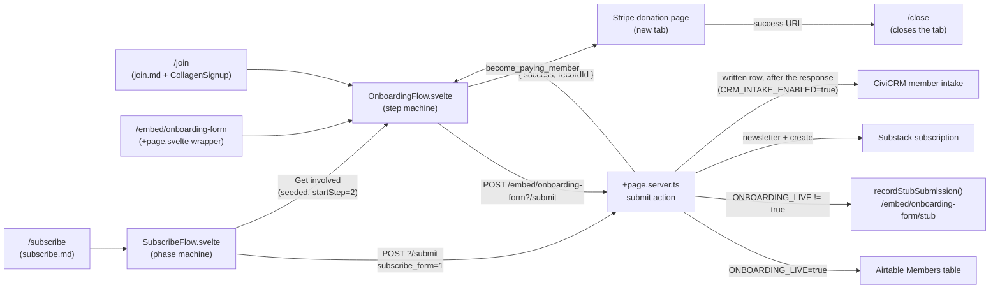
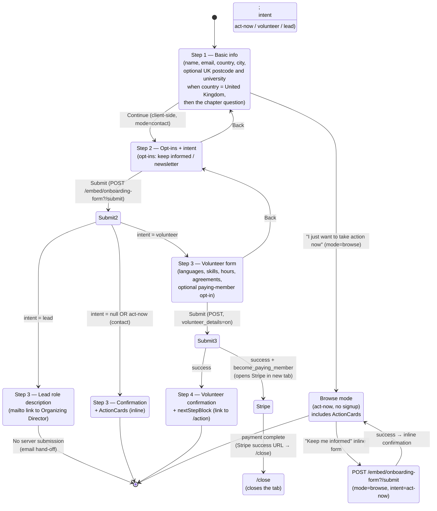

# Join Form Flow

This document describes the flow of the PauseAI join / onboarding form, from the
landing page through to the Airtable write (or stub capture) and optional
Substack subscription. It also covers `/subscribe`, the newsletter-only signup,
which is a different form with a different consent model but posts to the same
endpoint.

## Entry points and how they interact

There are three entry points. Two mount the same `OnboardingFlow.svelte`
component with different wrappers; the third mounts `SubscribeFlow.svelte`, a
separate single-page form that can hand off to `OnboardingFlow` mid-flow. All
three share a single submit endpoint (`/embed/onboarding-form?/submit`), so the
server-side validation, Airtable write, and stub capture logic live in exactly
one place.

### Route 1 — `/join` (standalone page)

| File                                                  | Role                                                                                                                                                            |
| ----------------------------------------------------- | --------------------------------------------------------------------------------------------------------------------------------------------------------------- |
| `src/posts/join.md`                                   | Markdown post rendered by the generic `src/routes/[slug]/+page.svelte` route. Holds the page's `<script>` and mounts the two components.                        |
| `src/lib/components/CollagenSignup.svelte`            | Detects a Collagen campaign UID from the URL (`?collagen_uid_sayno=…`) and reads `?subscribe-email=`. Binds `userHasUid` and `subscribeEmail` back to the post. |
| `src/lib/components/onboarding/OnboardingFlow.svelte` | The multi-step form itself. Mounted with `initialEmail={subscribeEmail}` so a returning Collagen visitor's email is pre-filled.                                 |

Flow on `/join`:

1. `CollagenSignup` runs `detectAndStoreCollagenUid('sayno', page.url.searchParams)`
   on mount. If a UID is present it sets `userHasUid = true` and reads
   `subscribeEmail` from `?subscribe-email=`. When both are set it shows a
   "Welcome collage member!" banner with a `NewsletterSignup` form.
2. `OnboardingFlow` is rendered immediately below, regardless of Collagen state,
   so every `/join` visitor sees the full onboarding form. The Collagen banner
   is purely additive — it does not gate or replace the form.
3. When `userHasUid && subscribeEmail` are both truthy, `join.md` appends a
   short "Consider becoming an active PauseAI member using the form above!"
   prompt beneath the form.
4. `OnboardingFlow` does **not** receive `initialCountry` / `initialCity` /
   `initialLanguages` here — those are left at their defaults (empty / empty /
   `['English']`). Prefilling by geography is an embed-only feature (see below).

### Route 2 — `/embed/onboarding-form` (iframeable embed)

| File                                                    | Role                                                                                                                                          |
| ------------------------------------------------------- | --------------------------------------------------------------------------------------------------------------------------------------------- |
| `src/routes/embed/onboarding-form/+page.svelte`         | Thin wrapper around `OnboardingFlow`. Reads query params, sets the locale, applies the background color, and reports height to the host page. |
| `src/routes/embed/onboarding-form/+page.server.ts`      | Houses the `submit` action shared by **all three** entry points (see "Submit endpoint" below).                                                |
| `src/routes/embed/onboarding-form/stub/+page.svelte`    | Stub inspection page rendered when `ONBOARDING_LIVE` is not `true`.                                                                           |
| `src/routes/embed/onboarding-form/stub/+page.server.ts` | `load` function returning in-memory stub submissions.                                                                                         |

The embed wrapper does five things the `/join` route does not:

1. **Query-param prefill** — reads `?country=`, `?city=`, `?languages=` and
   passes them to `OnboardingFlow` as `initialCountry` / `initialCity` /
   `initialLanguages`. Unmatched language values are silently dropped against
   the stored values in `options.ts`. See `docs/ONBOARDING_EMBED.md` for the
   full param table and the rationale for which fields are not prefillable.
1. **Source attribution** — sets `initialSource` on `OnboardingFlow`, which
   posts it as a hidden `source` field on the create forms. It is `?source=` if
   present, else — when iframed — the host page URL from `document.referrer`
   (set in `onMount`, since `document.referrer` is not available during SSR).
   First-party pages (`/join`, `/subscribe`) pass nothing and the submit action
   falls back to the same-origin `Referer` path instead. Whatever arrives is
   sanitised and written to the `Source page` field on a create, e.g.
   `example.org/join`; `Signup source` is untouched. See "Signup source" under
   _Create versus update_ for the full resolution order.
1. **Locale** — reads `?locale=` and calls `setOnboardingLocale()` from
   `src/lib/components/onboarding/i18n.svelte.ts` so partner sites can render
   the form in a supported language.
1. **Background color** — reads `?bg=` (hex with or without `#`, or a CSS color
   name) and applies it as `style:background-color` on the wrapper so the embed
   blends into the host page.
1. **Height reporting** — when `window.self !== window.top` (i.e. iframed), a
   `ResizeObserver` posts `{ height: number }` to the parent via `postMessage`
   on every layout change so the host can resize the iframe. The wrapper also
   drops its `min-height: 100dvh` in embedded mode so the reported height can
   shrink as well as grow.

### Route 3 — `/subscribe` (newsletter-only signup)

| File                                                 | Role                                                                                                                                 |
| ---------------------------------------------------- | ------------------------------------------------------------------------------------------------------------------------------------ |
| `src/posts/subscribe.md`                             | Markdown post, `showTitle: false` so `SubscribeFlow` can own the heading. Reads `?subscribe-email=` and passes it as `initialEmail`. |
| `src/lib/components/onboarding/SubscribeFlow.svelte` | The single-page signup form, its thanks screen, and the hand-off into `OnboardingFlow`.                                              |

This route exists so someone who only wants the newsletter can finish in one
screen instead of walking the multi-step join flow. It asks for the same four
basics (name, email, country, city), the chapter-sharing question (see "Chapter
sharing") and the Substack opt-in. Four of its hidden inputs
carry meaning: `subscribe_form=1` picks its `Signup source`, `agree_gdpr=on` records
that signing up here is itself the consent, `keep_informed=on` is posted
unconditionally so every completed submission subscribes, and
`intent=None` is fixed, because the form never asks about intent: the row records
no intent until the person picks one in the "Get involved" continuation.

`SubscribeFlow` is a three-phase machine rather than a step counter:

- `form` — the signup itself.
- `thanks` — asks them to check their inbox for the verification email, with a
  "Get involved" button.
- `more` — renders `OnboardingFlow` seeded from the row that was just created,
  so choosing to do more **updates** that record rather than creating a second
  one. The seed is `startStep={2}`, `initialRecordId={recordId}`,
  `initialKeepInformed={true}` and `initialChapterAnswer` (the answer given on
  the form, null where it was not asked), plus the four basics.

Navigating to `/subscribe` while already on it resets the machine to `form` and
clears every field, so a second visitor on a shared device does not see the
previous person's details.

**Entry points into this route.** `handoffHref` is the switch: given that prop,
`NewsletterSignup` stops posting to Substack and instead navigates to
`/subscribe?subscribe-email=…`, in both its hydrated `goto()` and its native
form `action`, so the hand-off survives without JavaScript. The homepage box
sets it; the Collagen banner on `/join` does not, which is why that one still
posts to Substack. `?subscribe-email=` therefore has two independent consumers.

### The shared submit endpoint

All three entry points' onboarding forms `POST` to the same action:

```
action="/embed/onboarding-form?/submit"
```

This is intentional: the `submit` action in
`src/routes/embed/onboarding-form/+page.server.ts` is the single source of
truth for validation, Airtable writes, and stub capture. The one exception
worth knowing: a `NewsletterSignup` rendered without `handoffHref`, as the
Collagen banner on `/join` does, posts straight to Substack and never reaches
this action.

The `/join` route has **no** `+page.server.ts` with a `submit` action of its
own. SvelteKit's form actions are addressed by URL, so a form rendered on
`/join` can post to `/embed/onboarding-form?/submit` without any special
wiring.

The action returns `{ success: true, recordId, recordToken }` in live mode and
`{ success: true, recordId, recordToken, submission }` in stub mode. Both
components store that `recordId` and `recordToken`; `OnboardingFlow`'s
`submitWith` adds them to every later post as `record_id` and `record_token`,
which is what makes that submission an update instead of a duplicate. The
`/subscribe` hand-off passes both as props (`initialRecordId`,
`initialRecordToken`), never in a URL.

### Continuation token

An update needs more than a record id: `record_token` is the proof that the
browser posting `record_id` was handed it by the action.

`src/lib/server/onboardingContinuation.ts` mints and checks it. The token is
`v1.<expiry>.<signature>`: `<expiry>` is a Unix time in seconds, 25 hours after
minting (the stored copy's 24 hours, `SIGNUP_MAX_AGE_MS` in `signupMaxAge.ts`,
plus an hour, so a resume near the end of that window still carries a live
token), and `<signature>` is the unpadded base64url HMAC-SHA256, keyed by
`ONBOARDING_CONTINUATION_SECRET`, of
`onboarding-continuation:v1:<recordId>:<expiry>`. The action mints one with the
id on a create, and a fresh one on every update whose posted token was valid, so
a flow in progress never runs out, as the stored copy's age is reset on every
post. The holder keeps the row writable for as long as it posts at least once
every 24 hours. An update that went through without a valid token gets none
back, and the form keeps whatever token it held: a token is only ever issued
at a create or in exchange for a valid one.

On every update the action checks the posted token against the posted
`record_id`. What a missing, malformed, expired or wrong token does depends on
`ONBOARDING_CONTINUATION_ENFORCE`:

- not `true`: the update goes ahead, and the action reports it to Sentry
  (`Onboarding continuation token <verdict>`, with the record id, never the
  token). This is the rollout state: a session that began before tokens existed
  holds an id without one for up to 24 hours, and never gains one, so once
  enforcement is on its next update gets the 410 and it starts again.
- `true` (the same convention as `ONBOARDING_LIVE`): the update is refused with
  the same 410 status as a deleted row, so the form forgets the id and goes back
  to where consent is collected (see the 410 under "Resuming after a remount").
  Only the message differs: "Your signup session has expired. Please fill in the
  form again." rather than the deleted row's "We could not find your earlier
  signup. Please go through the form again." It never creates a row instead,
  which would bring back the duplicates the id exists to prevent.

Without `ONBOARDING_CONTINUATION_SECRET` the action mints no token and checks
nothing, whatever the switch says, and logs that once per cold start: a missing
secret must not break the volunteer step for everyone. The secret is only needed
where the form writes (Production); deploy previews run in stub mode without it.
Make it 32 random bytes (`openssl rand -base64 32`). Rotating it invalidates
every token in flight, so under enforcement every flow in progress gets the 410
and starts again: rotate it only when it may have leaked.

Rollout: set the secret, deploy, watch the reports fall off as sessions from
before the deploy expire, then after 24 hours set
`ONBOARDING_CONTINUATION_ENFORCE=true` and redeploy.

The verification link has its own token (next section). A create whose response
never arrived gets no token, so its retry creates a row, as before.

### Email verification link

The welcome email's link ticks the Members row's `Verified email`. It is `https://pauseai.info/verify?table=join&verificationKey=<key>&token=<token>`, where `<key>` is the row's `Airtable ID` formula (the record id without its `rec`) and `<token>` ties the link to the row's current address. `src/lib/server/emailVerification.ts` mints and checks it.

The token is `v1.<expiry>.<signature>`, the continuation token's shape with its own payload and secret: `<expiry>` is a Unix time in seconds, 90 days after minting, and `<signature>` is the unpadded base64url HMAC-SHA256, keyed by the UTF-8 bytes of `EMAIL_VERIFICATION_SECRET`, of `email-verification:v1:<recordId>:<emailHash>:<expiry>`. `<recordId>` is the full record id (`rec…`). `<emailHash>` is the lowercase hex SHA-256 of the UTF-8 bytes of the normalised `Email`: leading and trailing ASCII whitespace (space, tab, LF, VT, FF, CR) stripped, A to Z lowercased, nothing else changed (no Unicode case folding or normalisation); in PHP, `strtolower(trim($email, " \t\n\v\f\r"))` from PHP 8.2. CiviCRM is to mint the same tokens once the welcome moves there, so `src/lib/server/emailVerification.vectors.json` holds test vectors (inputs, normalised address, hash, payload, token) that both implementations must reproduce; change it together with any change to the format.

**Minting.** `/api/onboarding-email` reads the row's current `Email` from Airtable and signs the link it renders into the welcome, so every composed welcome carries a signed link. The Airtable sender's request is unchanged, and the link still contains the key it checks both bodies for. Without the secret, or when the row cannot be read or has no `Email` (reported to Sentry with the record id), the welcome gets the unsigned link instead. A missing secret is reported to Sentry once per cold start where `ONBOARDING_LIVE` is on. The sender's template fallback always sends the unsigned link. The CRM's render, `/api/onboarding-email/v2`, signs over the address the CRM says it is mailing (`to_email`) instead of reading the row, and refuses to render without the secret rather than give an unsigned link (`docs/onboarding-email-v2-contract.md`).

**Checking.** `/verify` takes the link's query out of the address bar and posts it to `/api/verify` in the request body, keeping it out of the API's request URLs (`redactLinkCredentials` in `src/lib/sentry.ts` also strips such a query from client and server Sentry reports). For `table=join`, `/api/verify` then:

- with a token and the secret set: checks the token against the row the key names and that row's `Email` now. Expired, tampered, for another row, or minted for an address the row no longer has: refused.
- without a token, or while the secret is unset: accepts the link only when the row has `Sent emails` ticked (the Airtable sender's record that it mailed a link) and either the row is under 30 days old or the click is within 30 days of `LEGACY_LINK_CUTOVER`, the day signed links were deployed. Otherwise refused.

Unsigned links are a transition measure for mail sent before this change and by the Airtable sender's template fallback; they stop being accepted once signup mail moves to the CRM.

Refused answers 410 `{ outcome: 'expired' }`, and `/verify` explains that links last 90 days and only for the address they were sent to, with a mailto to info@pauseai.info for a new link. A "send me a new link" button needs a sender that can mail one (CiviCRM, pauseai-civicrm#668) and is a later step. An accepted link then follows `Merged into` with the safeguards in `mergedMemberRow.ts`, unchanged, and ticks the result. `table=statement` (signatory verification) is unchanged.

**Bound to the address.** An update from the form that changes the row's normalised `Email` writes `Verified email: false` in the same Airtable write, so the tick does not carry over to the new address. Every live update therefore reads the row first. After ticking a row for a signed link, `/api/verify` reads the row again and, if its normalised `Email` is no longer the address the token was checked against, writes `Verified email: false` and answers the same 410 refusal, since Airtable has no conditional write to make the check and the tick one step.

**Secret.** `EMAIL_VERIFICATION_SECRET`, 32 random bytes (`openssl rand -base64 32`), in Netlify's Production context; separate from `ONBOARDING_CONTINUATION_SECRET`. Unset, the site logs it once per cold start, renders unsigned links and judges every link by the unsigned rule above, so nothing breaks. Rotating it invalidates every signed link in delivered mail: rotate only when needed.

### Resuming after a remount

The server never matches a signup by email, so the id in component state is
the only thing that stops a second row, and every fresh mount loses it: moving
to another page and back (the layout keys pages on their pathname), a reload,
the language switcher's reload, a reloaded iframe, or `/subscribe` followed by
the site's own "Join" link. `signupResume.ts` therefore also keeps the row in
`sessionStorage` for 24 hours: its id and continuation token, the email it was
posted with, and what it holds for the two fields every update rewrites from the
post, `Email subscription` and `Intent`, plus the chapter-sharing answer the row
holds and the country it was given for, so a resumed form does not ask again for
that country.

- Both components save it after every successful post that returns an id.
- `OnboardingFlow` picks it up when step 1 continues (or, for the browse form,
  when it submits) **only for the same email**, ignoring case and surrounding
  spaces.
- A picked-up id is only ever posted with the email it was picked up for.
  Another email after Back starts a row of its own, and drops the opt-in and
  intent restored for the previous one. An id created in this mount is not
  bound, as before: fixing a typo in the email after Back corrects that row.
- It restores `keepInformed` and preselects the stored intent, so the update
  doesn't clear the subscription (see the hazard below) or reset the intent. The
  browse form, which always posts `Act now`, never lowers a Volunteer or Lead
  the row holds. A stored `stub-` id is ignored in live mode.
- Its posts carry `resumed=1` until one succeeds. The action then treats the
  post as this form's signup: consent is required and a Substack opt-in counts.
  The chapter question is shown unless the stored row has an answer for the
  country now selected; otherwise the earlier answer stands and the post carries
  none. A row with no answer (a US row, or one from before the question), or one
  answered for another country, is asked again, and the update writes the new
  answer and wording. The form takes the answer each successful post leaves on
  the row as the one it holds, so after answering for another country, Back and
  the first country asks again. The server checks the same thing against the
  row itself (see "Chapter sharing"), and where the two disagree its 400
  carries `chapterAnswerMissing`: the form then drops the answer it holds, in
  memory and in `sessionStorage` (`forgetChapterAnswer`), and goes back to the
  question (`afterChapterAnswerMissing`): step 1, the browse form where it is,
  or the `/subscribe` continuation's intent step, which shows the question only
  then. Step 1 and the browse form, which pick the row up only
  when they submit, read the stored row as soon as the email is typed to decide
  whether to show the question. A picked-up row's answer counts only while the
  email is the one it was picked up for: after Back and another email, which
  gets a row of its own, the question shows again. `onSignup`
  (the embed's `onboarding_signup_complete` message) does not fire again: the row was
  announced when it was created.
- `SubscribeFlow` saves but never resumes: it always posts `intent=None`, which
  would undo an intent chosen on `/join`.
- A failed update keeps the stored id, so an outage's retry does not create a
  duplicate. Only when Airtable reports the row gone (`ROW_DOES_NOT_EXIST`, for a
  deleted row too), or once enforcement is on, the post carries no valid
  continuation token, does the action answer 410, and the form then drops the
  id, its token and their stored copy and goes back to where consent is
  collected, since the next pass creates a row (`afterRecordGone` in
  `signupResume.ts`): the browse form posts its own and just retries, the
  contact flow returns to step 1, and the `/subscribe` continuation, which hides
  consent, calls `onRecordGone` so `SubscribeFlow` shows its signup form again
  with the details kept. That last case is reachable: the thanks page left open
  past the token's expiry, or a row created while the secret was unset.

It does not cover another tab or device, or a chapter site's iframe, whose
storage the browser keeps apart from pauseai.info's. Nor a create whose response
never reached the browser; `subscribeToSubstackNewsletter` times out after five
seconds so that the response carrying the new id is not held up by Substack.

### Component overview

`OnboardingFlow.svelte` is a self-contained state machine. It owns:

- `step` (`1 → 4`), `mode` (`'contact' | 'browse'`), `intent`
  (`'act-now' | 'volunteer' | 'lead' | null`), and the `basics` / `volunteer` /
  `agreements` / `gdprConsent` / `becomePayingMember` state.
- **Anti-bot protection state:** `turnstileToken`, `turnstileNonce` (manages
  widget remounts after each submission), and the derived `canSubmit` flag
  (gates submit buttons until Turnstile verification is complete).
- All form markup for steps 1–4, including the browse-mode inline signup and
  the lead-path `mailto:` hand-off (no submission).
- A `submitWith(onSuccess)` helper that wraps SvelteKit's `enhance` to manage
  the `submitting` flag, reset the Turnstile widget after submission, capture
  the returned `recordId`, and surface errors via `svelte-french-toast`.

It delegates rendering to a few child components and snippets:

| Child                                      | Used for                                                                   |
| ------------------------------------------ | -------------------------------------------------------------------------- |
| `Stepper.svelte`                           | The numbered step indicator above the form (contact mode only).            |
| `ActionCards.svelte`                       | The "ways to help" card grid shown on the act-now confirmation / browse.   |
| `Combobox.svelte`                          | The searchable country dropdown (used in step 1 and browse signup).        |
| `Turnstile.svelte`                         | The Cloudflare Turnstile anti-bot widget rendered before every submission. |
| `LinkWithoutIcon.svelte`, `Socials.svelte` | Footer links on confirmation screens.                                      |

`SubscribeFlow.svelte` is one screen of fields with the same honeypot and
Turnstile protection, plus the phase machine described under Route 3.

On mount, both components fetch `GET /api/onboarding-mode`. `OnboardingFlow`
logs the answer to the browser console; both use it to decide whether the
Turnstile widget renders and whether a token is required to submit. This is needed because the
pages embedding the form can be prerendered (e.g. `/join`), so the runtime env
isn't available at render time.

### Supporting API routes

| Route                      | File                                        | Purpose                                                                                                                                                                                                                                                                                                                                                                                                                                     |
| -------------------------- | ------------------------------------------- | ------------------------------------------------------------------------------------------------------------------------------------------------------------------------------------------------------------------------------------------------------------------------------------------------------------------------------------------------------------------------------------------------------------------------------------------- |
| `GET /api/onboarding-mode` | `src/routes/api/onboarding-mode/+server.ts` | Returns `{ live: boolean }` so the prerendered form can discover the runtime mode.                                                                                                                                                                                                                                                                                                                                                          |
| `GET /api/national-groups` | `src/routes/api/national-groups/+server.ts` | Returns the list of national groups. Used by the components (whether the country has a chapter, for the chapter question and the lead-role copy) and the submit action (stub inspection only). Both read a cache in `src/lib/server/nationalGroups.ts`: one Airtable read per server instance every 10 minutes, given up after 5 seconds, and after a failed read (reported to Sentry) the last good list for a minute before trying again. |

### How a submission travels


```mermaid
flowchart LR
    Join["/join<br/>(join.md + CollagenSignup)"] --> Flow
    Embed["/embed/onboarding-form<br/>(+page.svelte wrapper)"] --> Flow
    Subscribe["/subscribe<br/>(subscribe.md)"] --> SubFlow
    SubFlow["SubscribeFlow.svelte<br/>(phase machine)"] -- "POST ?/submit<br/>subscribe_form=1" --> Action
    SubFlow -- "Get involved<br/>(seeded, startStep=2)" --> Flow
    Flow["OnboardingFlow.svelte<br/>(step machine)"] -- "POST /embed/onboarding-form?/submit" --> Action["+page.server.ts<br/>submit action"]
    Action -- "ONBOARDING_LIVE=true" --> Airtable["Airtable Members table"]
    Action -- "ONBOARDING_LIVE != true" --> Stub["recordStubSubmission()<br/>/embed/onboarding-form/stub"]
    Action -- "newsletter + create" --> Substack["Substack subscription"]
    Action -- "written row, after the response<br/>(CRM_INTAKE_ENABLED=true)" --> CRM["CiviCRM member intake"]
    Action -- "{ success, recordId }" --> Flow
    Flow -- "become_paying_member" --> Stripe["Stripe donation page<br/>(new tab)"]
    Stripe -- "success URL" --> Close["/close<br/>(closes the tab)"]
```

Every entry point converges on the same action, so validation rules, field
allowlists, and the live/stub switch only need to be maintained in one place.

## Step machine

`OnboardingFlow` is a small state machine with a `step` counter
(`1 → 2 → 3 → 4`) and two derived values: `mode` (`'contact' | 'browse'`) and
`intent` (`'act-now' | 'volunteer' | 'lead' | null`).


```mermaid
stateDiagram-v2
    [*] --> Step1
    Step1: Step 1 — Basic info<br/>(name, email, country, city,<br/>optional UK postcode and university<br/>when country = United Kingdom,<br/>then the chapter question)
    Step1 --> Step2: Continue (client-side, mode=contact)
    Step1 --> Browse: "I just want to take action now" (mode=browse)
    Browse: Browse mode<br/>(act-now, no signup)<br/>includes ActionCards

    Step2: Step 2 — Opt-ins + intent<br/>(opt-ins: keep informed / newsletter;<br/>intent: act-now / volunteer / lead)
    Step2 --> Step1: Back
    Step2 --> Submit2: Submit (POST /embed/onboarding-form?/submit)
    Submit2 --> Step3Confirm: intent = null OR act-now (contact)
    Submit2 --> Step3Volunteer: intent = volunteer
    Submit2 --> Step3Lead: intent = lead

    Browse --> BrowseSignup: "Keep me informed" inline form
    BrowseSignup: POST /embed/onboarding-form?/submit<br/>(mode=browse, intent=act-now)
    BrowseSignup --> Browse: success → inline confirmation

    Step3Volunteer: Step 3 — Volunteer form<br/>(languages, skills, hours, agreements,<br/>optional paying-member opt-in)
    Step3Volunteer --> Step2: Back
    Step3Volunteer --> Submit3: Submit (POST, volunteer_details=on)
    Submit3 --> Stripe: success + become_paying_member<br/>(opens Stripe in new tab)
    Stripe --> Close: payment complete<br/>(Stripe success URL → /close)
    Close: /close<br/>(closes the tab)
    Submit3 --> Step4: success

    Step3Lead: Step 3 — Lead role description<br/>(mailto link to Organizing Director)
    Step3Lead --> [*]: No server submission<br/>(email hand-off)

    Step3Confirm: Step 3 — Confirmation<br/>+ ActionCards (inline)
    Step4: Step 4 — Volunteer confirmation<br/>+ nextStepBlock (link to /action)
    Step3Confirm --> [*]
    Step4 --> [*]
    Browse --> [*]
```

Every screen that follows a created row (steps 3 and 4 above, the browse
form's inline confirmation, and the `/subscribe` thanks screen) leads with
"Check your inbox" and asks the person to click the link in the verification
email that creating the row sends. Browse mode shows it only after its inline
signup, since browsing alone submits no email.

Step 1 asks the chapter question once a country from the list is picked (see
"Chapter sharing"); Continue stays disabled until it is answered, the one gate on
step 1 that is not native validation, with a line under it saying why (or that
the question is still loading). `continueToIntent` refuses to advance without
the answer too, since step 2 creates the row and cannot ask for it. Step 2 shows the two email opt-ins above
the intent cards, with a
critical-alert disclosure under the opt-ins (`aria-describedby` on both, so
screen readers reach it). On `/join`, neither the opt-ins nor an intent is
required: a submission carrying only the GDPR consent is valid and lands on
the critical-alerts tier only.

### Continuation mode

The diagram above describes a fresh `/join` visit. When `OnboardingFlow` is
mounted by the `/subscribe` hand-off it runs in **continuation mode**, which
`isContinuation` derives from `startStep === 2 && !!initialRecordId`. The person
has already given their details and consent, so step 2 becomes a single
question, "what do you want to do", rather than a signup:

- The keep-informed and Substack opt-in cards are hidden, as are the chapter
  question and the GDPR consent checkbox, because all were answered on the
  subscribe form. The post carries no chapter answer, so the server leaves the
  one from `/subscribe` alone; the Volunteer and Lead copy follows it. Only if
  the server answers that the row holds no answer for its country does step 2
  show the question and require it (see "Resuming after a remount").
- Picking an intent becomes **required** to submit. On a fresh visit nothing
  beyond the GDPR consent is required, so this is a different submit gate, not
  just a different layout.
- A 410 cannot go back to step 1, which would post without consent, so it calls
  `onRecordGone` and `SubscribeFlow` returns to its own form.

So the `Step2 --> Step1: Back` edge and the opt-in-only submit path in the
diagram do not exist in this mode.

## Create versus update

A post carrying `record_id` is an **update**; anything else is a **create**.
An update is gated on `record_token` (see "Continuation token" above).
This is the axis most of the action's behaviour turns on, and its rules
otherwise scatter across the write and the validation, so they are collected
here.

On an update:

- The required-field presence check is skipped, so it cannot re-demand what the
  create already collected. The `email` regex and the `intent` enum still run,
  so an update carrying neither is rejected anyway.
- `Signup source` is never rewritten. It is provenance, stamped once at create
  by `signupSource` in `options.ts`: `October 2026 subscribe form` for
  `/subscribe`, `October 2026 onboarding flow` otherwise, each with ` (US)`
  appended when the country is `United States`, which is not asked the chapter
  question. Rows created before the question keep their `June 2026 …` values.
  It is a label: the CRM does not match it (see "Chapter sharing" for what
  Airtable does). Without the "create only" rule the volunteer step, which
  carries no subscribe marker, would rewrite a subscribe row as a join row.
- `Form version` is written next to it, also create-only: the number
  `FORM_VERSION` in `options.ts` (2), on every row either form creates. It names
  the rules the CRM applies to the row (see "Chapter sharing"), so an update must
  not move it.
- `Signup emails sent by` is written next to it while `SIGNUP_EMAILS_SENT_BY_CRM` is
  `true`, also create-only, so a row's sender is fixed when it is created (see
  "Signup emails sent by").
- `Source page` is written next to it, also create-only, recording where the
  signup came from. `resolveSourcePage` takes the first of: the hidden `source`
  field (an embed's `?source=`, or the host page URL the embed wrapper read from
  `document.referrer`); else this request's `Referer` path when it is same-origin
  and not `/embed/onboarding-form*` (first-party `/join` etc. → `pauseai.info/join`);
  else nothing (field left unset). The result is sanitised to a host/path slug
  (word chars, spaces, dashes, dots, slashes; max 80).
- GDPR consent is not required, because it was captured at create.
- `Full name`, `Country` and `City` are overwritten only when the post supplies
  a non-empty value, so a partial post cannot blank what the create collected.

That last guard covers those three fields and no others. `Email`, `Intent` and
`Email subscription` are taken from the post on every call (an `Email` that changes also unticks `Verified email`; see "Email verification link"), and
`Data privacy policy agreed` is hard-coded to `true` on every call whether or
not the post carries `agree_gdpr`.

**The hazard that follows.** An update omitting `keep_informed` writes
`Email subscription: false`, and nothing on the server preserves it. What
preserves it is the client reposting it from state, through **two** separate
`{#if keepInformed}` hidden inputs in `OnboardingFlow`, one on the step-2
intent form and one on the step-3 volunteer form. Dropping either silently
clears that person's subscription flag, with no error and no other symptom.
Both inputs carry a comment saying so.

Which form posted is carried by `subscribe_form=1`, set only by `/subscribe`.
The action reads it for one decision: which `Signup source` to stamp on a
create.

## Data written to Airtable

Target: base `appWPTGqZmUcs3NWu`, table `tblL1icZBhTV1gQ9o` ("Members").

**Step 2 / browse signup / subscribe form (create):** `Full name`, `Email`,
`Country`, `City`, `Intent`, `Signup source`, `Form version`, `Signup emails sent by`
(while `SIGNUP_EMAILS_SENT_BY_CRM` is `true`), `Source page` (when resolved),
`Email subscription` (keep_informed), `Data privacy policy agreed`,
`GDPR chapter share permission` and `GDPR chapter share wording` (cleared to
unticked and empty in the United States), plus `Zip code` when `country` is
`United Kingdom` and a postcode was entered (the optional step-1 UK postcode —
see "Validation rules" — carried in the `zip_code` field, sharing it with the US
volunteer ZIP below) and
`University` when a university was chosen (see "Validation rules").
Every field there has a rule under "Create versus update" above or "Chapter
sharing" below, so treat this list as the index to those rules.

**Step 3 volunteer (update, only when `volunteer_details=on`):** the volunteer
detail fields, written by the `intent === 'Volunteer' && hasVolunteerDetails`
block in the action. That block is the list. Copying it here only creates a
second one to keep in sync, which is how it came to be missing a field.

### Chapter sharing

`GDPR chapter share permission` records whether the person agreed to their
details being shared with the PauseAI chapter in their country, and
`GDPR chapter share wording` the text they were shown when they answered: the
heading, the explanation and the option they picked (`[chosen] …`), in the
language shown. A No is stored with its wording too, as evidence of what was
declined. Both are written together, in the same Airtable call as the rest of
the row, and only from an explicit answer.

Every form that creates a row asks the same question, with no default, after
its other fields and directly above its submit button, once a country from the
list is picked: step 1 of `/join`, the browse signup card, and `/subscribe`
(whose Yes also covers chapter email, since nothing else on that form names the
chapter as a sender). It fades and slides in when it appears or its variant
changes with the country, with no animation under `prefers-reduced-motion`.
Focus is never moved into it; it appears in the reading order after the fields
just filled in. `ChapterShareQuestion.svelte` renders it
and `chapterShare.ts` builds its text. The form that shows it posts
`chapter_share` (`yes` or `no`) and `chapter_share_wording`, except on `/join`:
step 1 posts nothing, so step 2, which creates the row, posts the step-1 answer
and the wording shown with it as hidden inputs. Step 2's Keep me informed,
Volunteer and Lead copy and the nudge follow that answer. An answer belongs to
the country it was given for: changing the country asks again. Where the country has a
chapter (it is in `/api/national-groups`) the question names it: "PauseAI <country>",
or the chapter's own name from `CHAPTER_DISPLAY_NAMES` in `chapterShare.ts`
(the National Chapters table holds no display name); elsewhere it asks about a chapter "when one starts". It
waits for that lookup, and a failed lookup, or one taking over five seconds,
counts as no chapter. The forms get that list through the CDN, which may
serve it up to an hour old (the route's `max-age`). The action does not use the
list to check a wording (see "Validation rules"), so a form on an older list is
never refused for it; for up to that hour after a chapter is deactivated, a form
may still name it, and the stored wording records that faithfully.

The embed replaces this question, and the separate Privacy Policy checkbox
(`agree_gdpr`), with a single checkbox when it detects it's iframed on that
same chapter's own site: `/embed/onboarding-form/+page.svelte` matches
`document.referrer`'s host against each national group's `website` field
(`loadChapterSiteCountry`), and when that detected country is the one the
visitor picked, `OnboardingFlow.svelte`'s `isChapterSiteQuestion` is true. The
checkbox ("Share my details with PauseAI UK and PauseAI Global") has no
heading or body — just itself — and covers both consents at once: checking it
sets `gdprConsent` and the chapter answer (always `yes`) together, unchecking
clears both. There is no "chapter only" option here, only both-or-neither, and
`chapterShareWording` drops the (now empty) heading/body lines so the stored
evidence is just the checkbox's own text (`chapterShare.ts`, `'chapter-site'`
form). Step 1's `chapterSiteConsentField` never actually posts — its form is
intercepted client-side — so step 2 mirrors its answer into a hidden
`agree_gdpr` input alongside the existing `chapter_share`/`chapter_share_wording`
ones, and skips the normal Privacy Policy checkbox entirely in this mode.

The country an answer is for is the posted `country`, or, on an update that
posts none, the one the row holds. An update whose post leaves the answer to the
row (no answer posted for a non-US country, or no country posted) reads the row
from Airtable first, after the continuation token check, to know that country
and whether the row holds an answer for it.

| case                                                                                                                                  | what is written                                                                                                                                                                                                     |
| ------------------------------------------------------------------------------------------------------------------------------------- | ------------------------------------------------------------------------------------------------------------------------------------------------------------------------------------------------------------------- |
| create outside the United States                                                                                                      | the box from the answer (ticked for Yes) and the wording; a create without an answer is refused with a 400                                                                                                          |
| any post whose country is United States (create or update)                                                                            | the box unticked and the wording empty: the question is not shown there, as PauseAI US is not a chapter, and a row whose country changed to the US after answering keeps no answer naming another country's chapter |
| update that carries an answer (Back to step 1 and resubmit, or a resumed row with no answer for this country yet)                     | the box and the wording from the answer                                                                                                                                                                             |
| update that does not (the volunteer step, the `/subscribe` "do more" step, a resumed row that already has an answer for this country) | neither field, so the earlier answer stands, if the row holds one for this country; otherwise refused with a 400                                                                                                    |

The row holds an answer for a country when its stored wording is non-empty and
its stored `Country` is that country (ignoring case). The wording is not checked
again: it was checked against the form's exact text when it was posted, and a
later copy edit, chapter rename or deactivation, or a staff edit of the row must
not turn a given answer into a missing one, which a volunteer step or the
`/subscribe` continuation could not answer without being sent back to the
question. A row with no wording (a US row, or one from before the question), or
whose country is another, has none. Since only the country is compared, a staff
edit of a row's `Country` alone, leaving its wording, makes the row count as
answered for the new country. So outside the US an unticked box
on a row created by this form is a No (it carries the wording), not a question
never asked, whichever post last changed the row's country. In stub mode there is no
row to read, so an update without an answer is let through, as it writes
nothing.

The answer is not a mail permission. Keep me informed is the only source of
chapter mail and is never pre-ticked; after a Yes with Volunteer or Lead picked
and Keep me informed unticked, step 2 points at it. Volunteer and Lead "will be
in touch by email" means one-to-one follow-up about their request.

The CRM matches no `Signup source` value. It reads two recorded facts instead:
whether the question was asked is the stored `GDPR chapter share wording`, which
the form writes only where it showed the question and clears where it is hidden
(an unticked box with a wording is a No, without one never asked), and which
rules the row follows is `Form version`. A version at least the CRM's
`CRM_PauseaiCore_MemberRow::CURRENT_FORM_VERSION` (2) gets the current rules: the
newsletter only on Keep me informed, the chapter answer and the memberships
written at signup by intake, and a chapter only on a recorded Yes. A row without
one gets the legacy rules, except one carrying an October 2026 label, which
predates the field and counts as version 2 (a closed list in the CRM). So a new
form or a new `Signup source` label needs no CRM change. Bump `FORM_VERSION`, together with the CRM's constant, only when the
rules a new row follows change. The Members field `Form version` (number,
integer) must exist before a deploy that writes it, since Airtable refuses a
write naming an unknown field. Airtable does not list the sources either. The
roster formula `Excluded from chapter roster` reads the stored wording, which the
form writes only when it asked, and the "Subscriber becomes Volunteer/Lead"
trigger matches the phrase "subscribe form", which every /subscribe value must
keep.

This field is not only stored. The Airtable automations on the Members table
read it to decide whether a signup is handed to their national chapter's leader
or to the global onboarding address, and whether a US signup is copied into the
sheet shared with PauseAI US, which no longer happens now that US signups are
not asked. Leaving it unticked is therefore a real routing decision, not a
preference flag.

Those automations live in Airtable, not in this repository, so nothing here can
prove that behaviour. Read them in the base's automation editor if you need the
exact conditions.

## Validation rules

Enforced in the `submit` action before any write. Bot protection runs before
all field validation; see "Bot protection" below. Which of these are relaxed on
an update is in "Create versus update" above.

- Required: `full_name`, `email`, `country`, `city`.
- `email` must match `^\S+@\S+\.\S+$`.
- `country` must be in `COUNTRIES`, checked only when one is supplied.
- UK postcode (`zip_code`) is **optional** when `country` is `United Kingdom`.
  When supplied, on a create or an update, it must match `UK_POSTCODE_PATTERN` —
  a **full** postcode (`SW1A 1AA`), inward half included, since the outward code
  alone can't identify a parliamentary constituency — else 400; a half-typed
  value is rejected rather than dropped. A missing or repeated inner space is
  tolerated. Collected on step 1 and the browse signup (the form blocks submit on
  an invalid one but accepts an empty one), and reposted from state by the
  volunteer step. Stored normalised (uppercased, one inner space) in Airtable's
  `Zip code` field, only when non-empty, so a partial repost can't blank it. For
  a non-UK country the field is ignored. The US volunteer ZIP uses the same
  `zip_code` field on the step-3 form (see below).
- `university` is optional, and only for a country with a list in
  `src/lib/data/universities` (today `United Kingdom`). When present it must be
  a `name` from that country's list, else 400; ignored for any other country.
  Stored as the plain name (no abbreviation) in Airtable's `University` field,
  only when non-empty. Collected on step 1 and the browse signup, and reposted
  from state on step 2.
- `intent` must be one of `INTENTS` (`None` | `Keep informed` | `Act now` |
  `Volunteer` | `Lead`). Step 2 submits `None` when no intent is picked; the
  browse signup hardcodes `Act now`; `/subscribe` hardcodes `None`. No form emits
  `Keep informed` any more, but it stays in `INTENTS` so a post carrying it is still
  accepted rather than rejected.
- A chapter answer (`chapter_share` of `yes` or `no`, with a
  `chapter_share_wording`) is required on a create outside the United States,
  and on an update unless the row already holds an answer for the country, else 400. Whenever an answer is posted, its wording, line endings normalised to LF,
  must be exactly one the posting form renders for that country and answer
  (`possibleWordings` in `chapterShare.ts`), else the same 400: `/subscribe`'s
  variant when `subscribe_form=1`, `/join`'s otherwise, in any locale, either
  naming the chapter as the forms do when their list has one for the country
  (`chapterName`, so "PauseAI <country>" or the `CHAPTER_DISPLAY_NAMES` entry)
  or as the no-chapter variant. The chapter list is not consulted, so the action
  and a form holding different copies of it cannot disagree. For the United States any posted answer is
  ignored and both fields are cleared. See "Chapter sharing".
- GDPR consent (`agree_gdpr`) required **only on the create path** — step-3
  volunteer updates are exempt because consent was captured at step 2.
  `/subscribe` posts it as a hidden field, since signing up on that form is
  itself the privacy-policy consent, which its microcopy links.
- Volunteer path additionally requires: ≥1 language, a valid `hours` value, and
  both `agree_volunteer` and `agree_conduct` checkboxes.

## Bot protection

Two layers, catching different bots:

1. **Client-side honeypot:** a hidden `nickname` input that only bots render and
   complete. When non-empty the submission silently succeeds without writing
   anything, so bots learn nothing. This catches bots that render the page.
2. **Server-side Turnstile verification:** `checkNotSpam()` in
   `src/lib/server/turnstile-verify.ts`, which is commented in full and is the
   place to read the exact checks. This catches bots that POST directly to the
   endpoint, bypassing the honeypot.

One Turnstile property is easy to over-assume, so it is worth stating here: the
token's hostname is compared against the request hostname **only when Turnstile
reports one, and only outside dev**. An absent hostname is accepted by design,
so that a missing field cannot lock out legitimate senders, and the comparison
is hostname against hostname rather than a full origin match. Note that dev and
`ONBOARDING_LIVE` are independent, so a live-mode dev build skips the check.

Tokens are single-use and expire after five minutes, so both forms remount the
widget through a `turnstileNonce` state variable once a submission resolves, on
every result rather than only the successful ones: verification spends the token
whether or not the write succeeded. That is a cross-file contract, and dropping
the remount on any branch leaves a retry reposting a spent token.

Turnstile runs in live mode only, for the reasons under "Live vs. stub mode".

## Live vs. stub mode

`isOnboardingLive()` in `src/lib/server/onboarding.ts` reads the
`ONBOARDING_LIVE` env var. When false (default), submissions are captured
in-memory by `recordStubSubmission()` and rendered at
`/embed/onboarding-form/stub` for inspection — no Airtable write and no Substack
subscription occur. The component surfaces the current mode in the browser
console via `GET /api/onboarding-mode`.

Bot protection follows the same switch. The honeypot runs on every submission,
but Turnstile verification runs only in live mode: in stub mode there is no
record, no subscription and no mail to protect, and requiring it would make the
form untestable on deploy previews, whose hostname the Turnstile site key does
not allow (the widget refuses to render, so no token can exist). The client
mirrors this, and assumes live until `/api/onboarding-mode` says otherwise.

`ONBOARDING_LIVE=true` therefore has to stay scoped to the **Production**
context in Netlify, as it is today (production reports `live: true`, deploy
previews `live: false`). Set site-wide it would also make previews live, which
both brings the untestable-preview problem back and lets a preview run write
real Airtable and Substack data.

## CRM intake

After every Airtable write the action makes, create or update, the action reports the row to CiviCRM's member intake (`PauseaiMemberIntake.submit`), so the CRM learns of a signup at once rather than at its nightly import. That covers the step-2 create, the browse signup, the step-3 volunteer update, `/subscribe` and its continuation. The code is `src/lib/server/crmIntake.ts`; the contract (request, token rule, outcome codes) is pauseai-civicrm's [`docs/intake-endpoint-plan.md`](https://github.com/PauseAI/pauseai-civicrm/blob/main/docs/intake-endpoint-plan.md), and a renamed outcome code there needs a change here.

- **What is sent.** The record exactly as Airtable answered the write (`id`, `createdTime`, `fields`), which is why `createRecord` and `updateRecord` return it: the whole row every time, not only what the post changed. With it goes the continuation token the post carried (`record_token`), or `""` on a create. The server never mints one for the CRM: the CRM judges the browser's token itself, so an update the website let through without a valid token (`ONBOARDING_CONTINUATION_ENFORCE` not `true`) is refused there.
- **Never in the way of the signup.** The call is made only after Airtable accepted the write, and handed to the edge function's `context.waitUntil`, so the response does not wait for it; on the Node dev server, which has no platform context, it simply runs on. It gives up after 3 seconds. Whatever it returns, the user's response is the same.
- **Outcomes.** `ok`; `refused:<reason>` with the CRM's code (`token_required`, `merged`, ...); `error` for anything else (an HTTP error or an answer that is neither, a timeout, a network failure, missing configuration). Refusals go to Sentry as warnings and errors as errors, one issue per outcome code, carrying the record id, the outcome and its cause (for an HTTP error, only the status), never a field value, the token, the key or the CRM's error text, which could echo what the request carried. Nothing is retried: the next step of the form or the CRM's nightly import sends the row again. Calls are idempotent but not order-safe: each writes the whole row and carries no row version, so two quick updates to the same row can land in the CRM out of order, which the nightly import repairs; and a create delayed past the update that follows it is refused `token_required`, one spurious Sentry warning.
- **Switching it on.** Stub mode never calls the CRM. In live mode the call needs `CRM_INTAKE_ENABLED=true` (anything else is off, the default), `CRM_INTAKE_URL` (the CRM's base URL, e.g. `https://crm.pauseai.info`) and `CRM_INTAKE_KEY` (the CRM's member intake API account key), all three in Netlify's **Production** context only, like `ONBOARDING_LIVE`. With the flag on and either of the others missing, every write reports `error` (cause `not_configured`). The CRM refuses an update without a valid token, so turn it on only once `ONBOARDING_CONTINUATION_ENFORCE=true`, and only once the CRM has the same `ONBOARDING_CONTINUATION_SECRET`.

## Signup emails sent by

The mail a new signup triggers (the welcome with its verification link, and the alerts to onboarders) is sent either by Airtable's automations or by CiviCRM. The Members field `Signup emails sent by` (single select) records which: `CiviCRM` marks the row as CiviCRM's, and an empty field leaves it with Airtable. This form writes it; nothing else on the website does.

- **What is written.** While `SIGNUP_EMAILS_SENT_BY_CRM` is exactly `true` (anything else is off, the default), every row either form creates gets `Signup emails sent by` = `CiviCRM`, next to `Signup source` and `Form version`. With the flag off the form writes nothing to the field. In stub mode the field is only recorded in the stub submission, like the rest of the row.
- **Fixed at creation.** The field is never written on an update: not the volunteer step, the `/subscribe` continuation, or a resumed post. So a row's sender is decided once, by the flag's value when the row was created, and no later post can move it. Turning the flag off therefore only changes who sends for rows created from then on; rows already marked stay CiviCRM's. Rows created any other way (staff entries in Airtable) are never marked and stay Airtable's.
- **Before turning it on.** The Members field must exist, with the option `CiviCRM`, since Airtable refuses a write naming an unknown field. With the flag off nothing is written, so a deploy is safe before the field exists. Set the flag in Netlify's **Production** context only, like `ONBOARDING_LIVE`.
- **Turning it on is the cutover step** that hands new signups to CiviCRM. It comes last: CiviCRM's sending for marked rows is switched on first, then marking. Airtable's automations leave marked rows to CiviCRM, so a row marked before CiviCRM sends would get its signup emails from neither.

## Lead path (no submission)

When `intent = 'lead'`, step 3 renders a role description and a `mailto:` link
to the Organizing Director (Irina@pauseai.info). The country is checked against
`/api/national-groups` to decide between "National Group Lead" (no existing
chapter) and "Regional Group Lead" (chapter exists). No POST is made; the
hand-off happens off-platform via email.

## Paying member opt-in (volunteer step)

The volunteer form (step 3) includes an optional "I want to become a paying
member" checkbox (`become_paying_member`). It is **not** required, so it does
not gate the submit button.

When checked, the volunteer form opens the Stripe payment link in a new tab
with two query params, mirroring the legacy Tally form's `/submitted` contract:

- `prefilled_email` — the volunteer's email.
- `client_reference_id` — the Airtable record id, replacing Tally's submission id.

The popup is opened synchronously during the submit gesture (so iOS Safari
and Chrome on iOS allow it), then navigated to the final Stripe URL once the
record has been saved.

The user stays in the onboarding flow: the form advances to the step-4
volunteer confirmation regardless of whether the checkbox was checked. The
`/submitted` route is **not** used by this path — it remains for the legacy
Tally form only.

### Stripe success redirect (`/close`)

After completing payment, Stripe redirects the popup to [`/close`](../src/routes/close/+page.svelte),
which closes the tab automatically. If the browser blocks the close (e.g. the
user navigated manually), a brief "Thanks for your donation!" message is
shown as a fallback. The Stripe success URL must be configured to
`https://pauseai.info/close`.

## Related documents

- [`docs/ONBOARDING_EMBED.md`](./ONBOARDING_EMBED.md) — embed-specific details:
  the full query-param table (`country`, `city`, `languages`, `bg`), the
  `postMessage` height-resize contract for host pages, and the rationale for
  which fields are intentionally not prefillable via URL.
